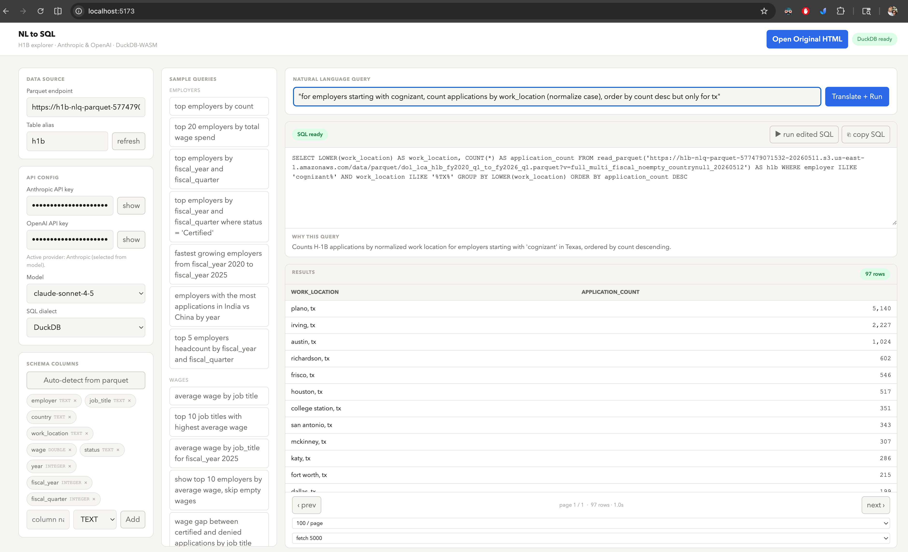

# natural-language-to-llm-query-comparison

A lightweight, browser-only app to compare natural-language-to-SQL generation behavior across LLM providers (Anthropic and OpenAI), then execute generated SQL with DuckDB-WASM on a Parquet dataset.



## What This Repo Does

- Loads data directly from a Parquet URL. (any parquet endpoint can be set- as the app allows for auto detection of schema)
- Includes schema auto-detection from parquet metadata.
- Translates natural language into SQL using either Anthropic or OpenAI chat models.
- Enforces structured model output (`sql` + one-line `explanation`) for reliable parsing.
- Runs generated SQL locally in-browser using DuckDB-WASM.
- Provides grouped sample queries to compare model behavior quickly.

## Prerequisites

- [Node.js](https://nodejs.org/) v18+
- An [Anthropic](https://platform.claude.com/) and/or [OpenAI](https://platform.openai.com/) API key — having both lets you switch providers on the fly
- A running Parquet endpoint — the default endpoint is generated by the [query-raw-data-using-llm](../query-raw-data-using-llm) repo; make sure that pipeline has completed before using the default data source

## Quick Start

```bash
npm i && npm run dev
```

## React 19 App

- This repository is a componentized React 19 + Vite app.
- Home route (`/`) runs the React implementation.
- Legacy route (`/legacy/nl_to_sql.html`) serves the preserved original HTML app.
- The React header includes an "Open Original HTML" button to launch the untouched legacy page in a new tab at any time.

### Run React App

1. Install dependencies: `npm install`
2. Start dev server: `npm run dev`
3. Build production assets: `npm run build`
4. Preview build: `npm run preview`

## How To Run

**React app (default):**
1. `npm i && npm run dev`
2. Open `http://localhost:5173` in a modern browser.
3. Set the Parquet endpoint and table alias (or use the default).
4. Add your Anthropic or OpenAI API key.
5. Pick a model + SQL dialect, enter a natural-language query, and click **Translate + Run**.

**Legacy HTML app (no build step):**
1. Open `public/legacy/nl_to_sql.html` directly in a browser, or use the "Open Original HTML" button in the React app header.

## Notes

- API calls are made directly from the browser to the selected provider.
- The API key is persisted in `localStorage` for convenience.
- DuckDB runs locally in-browser; no backend is required.

