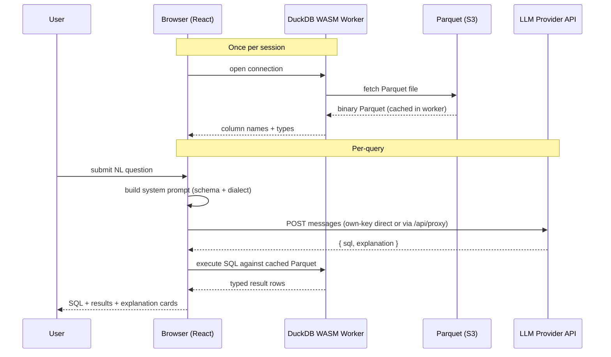

# Natural Language to SQL — DuckDB-WASM · Anthropic · OpenAI · Google

Browser-only **NL→SQL comparison tool**: describe what you want in plain English, get back a SQL query
and explanation from any of three LLM providers, then run it instantly against a Parquet file via
**DuckDB-WASM** — no backend, no uploads, no server. Provider and model are switchable at any time;
the same question to different models makes quality differences immediately visible.

> **Dataset source:** The default H1B LCA Parquet file is built and maintained in [`parse-lca-files-to-parquet`](../parse-lca-files-to-parquet/). That repo downloads the official DOL quarterly XLSX disclosures (FY2020 Q1 – FY2026 Q2), normalises them, and publishes combined and year-partitioned Parquet to S3. See its [README](../parse-lca-files-to-parquet/README.md#source-xlsx-by-quarter) for the per-quarter DOL source URLs and S3 endpoint pattern.

---

## Live Service

| Endpoint | URL |
|---|---|
| **App** | https://natural-language-to-llm-query-comparison.vercel.app/nl-to-sql/ |
| **Portfolio demo** | https://bganguly.github.io/#nl_to_sql |

> Browser-only via DuckDB-WASM — no backend or server required.

---

## Using the App

1. **Set the data source** — the default is a public H1B LCA disclosures Parquet file on S3. Paste any public Parquet URL and a table alias to use your own dataset; schema columns are auto-detected from Parquet metadata.
2. **Configure a provider** — choose Anthropic, OpenAI, or Google. Select `predefined` key mode to use server-side keys on Vercel, or `own-key` to enter your own (stored in `localStorage`, never sent to a backend).
3. **Pick a model** — the model dropdown is per-provider; switching models within the same provider compares quality within a family.
4. **Pick a SQL dialect** — DuckDB (default, runs in-browser), Presto/Athena, Spark SQL, or BigQuery. The system prompt changes; only DuckDB dialect is automatically executed.
5. **Enter a question** — type a natural-language query or pick from the grouped sample strip (`Employers`, `Wages`, `Geography`, `Trends`, `Status & Jobs`). Click **Translate + Run**.
6. **Review** — the SQL card shows the generated query, the explanation card shows the model's reasoning, and the results card shows DuckDB execution output.

### Sustained comparison across turns

Each query is **stateless** — the LLM receives no history from prior queries. To compare systematically across a session:

**Patterns that work well:**

| What you want | How to do it |
|:--|:--|
| Compare same question across providers | Run with Anthropic → note SQL → switch to OpenAI → run again; results stay on screen |
| Compare models within a provider | Keep provider fixed, change model, click Translate + Run |
| Refine a bad query | Read the explanation, then rephrase: *"top employers by count, excluding nulls in wage"* |
| Spot dialect differences | Generate with DuckDB first (runnable), then switch to BigQuery dialect to see syntax changes |
| Test a sparse-column edge case | Queries mentioning `country` surface a context note — the column is mostly null; use this to see how different models handle missing data |

**Practical tips:**

- **Explanation card is the key signal** — models that use JOIN vs CASE WHEN aggregation for the same question produce different row counts. The explanation reveals which approach was chosen.
- **Context notes (yellow banners)** — the app recognises certain column names and surfaces data-quality warnings; these are hardcoded, not LLM-generated, so they are always accurate.
- **LogPanel** — shows DuckDB WASM initialisation steps, Parquet fetch latency, and query execution time. Slow first queries are Parquet download; subsequent queries run against the cached in-memory file.
- **Schema card** — shows auto-detected column names and types. If a model references a column not in the schema card, execution will fail; rephrase using exact names from the card.
- **Dialect vs execution** — only DuckDB dialect generates runnable SQL in this app. Presto/Athena, Spark SQL, and BigQuery outputs are syntax references only.

---

## Architecture

### Query flow — step by step

1. **Schema detection (once per session)** — on Parquet URL change or page load, DuckDB-WASM fetches the Parquet file into the Web Worker and reads its metadata; `parquetTypeToSql()` maps raw types to SQL types shown in the Schema card.
2. **System prompt construction** — on query submit, `api.ts` builds a system prompt containing the table name, all detected columns with types, the target SQL dialect, and an instruction to respond with JSON `{ sql, explanation }` only.
3. **LLM call** — call goes directly to the provider API (own-key mode) or through `/api/proxy` (predefined mode); response is a raw JSON string potentially wrapped in markdown fences.
4. **Parse & display** — JSON is stripped of fences and parsed; `sql` appears in the SQL output card, `explanation` in the explanation card.
5. **DuckDB execution** — if dialect is DuckDB, the SQL is sent immediately to the Web Worker and executed against the cached Parquet; typed result rows appear in the results card.


```mermaid
sequenceDiagram
    participant U as User
    participant B as Browser (React)
    participant W as DuckDB WASM Worker
    participant P as Parquet (S3)
    participant LLM as LLM Provider API

    Note over B,W: Once per session
    B->>W: open connection
    W->>P: fetch Parquet file
    P-->>W: binary Parquet (cached in worker)
    W-->>B: column names + types

    Note over B,LLM: Per-query
    U->>B: submit NL question
    B->>B: build system prompt (schema + dialect)
    B->>LLM: POST messages (own-key direct or via /api/proxy)
    LLM-->>B: { sql, explanation }
    B->>W: execute SQL against cached Parquet
    W-->>B: typed result rows
    B-->>U: SQL + results + explanation cards
```

### Key design decisions

| Concern | Approach |
|:--|:--|
| **No backend for execution** | DuckDB-WASM runs generated SQL entirely in a browser Web Worker — no server round-trip, no data upload, no query latency beyond in-memory execution |
| **Single-turn LLM calls** | Each NL→SQL translation is a fresh call with no prior context; the schema and dialect are re-injected every time — stateless by design |
| **Direct browser API calls** | Own-key mode sends the API key directly to the provider from the browser; no key ever touches the app's server in this path |
| **Schema in system prompt** | Auto-detected column names and types are injected verbatim — the model generates SQL against the real schema, not a hardcoded template |
| **Dialect as a prompt parameter** | The SQL dialect is a sentence in the system prompt, not a post-processing step; each model generates syntactically distinct SQL per dialect |
| **Context notes** | Hardcoded `NOTES` in `constants.ts` match query substrings and surface data-quality warnings — not LLM-generated, so always accurate regardless of model |
| **No simultaneous multi-provider calls** | Comparison is done by switching providers and re-running, not concurrent calls — avoids race conditions in result display |

## Stack

| Component | Implementation |
|---|---|
| **NL→SQL translation** | Single-turn LLM call; system prompt contains table name, detected column types, target SQL dialect, and instruction to respond with JSON `{ sql, explanation }` only |
| **Anthropic path** | `POST https://api.anthropic.com/v1/messages` with `anthropic-dangerous-direct-browser-access: true` — direct browser call |
| **OpenAI path** | `POST https://api.openai.com/v1/chat/completions` — direct browser call |
| **Google path** | `POST https://generativelanguage.googleapis.com/v1beta/models/{model}:generateContent` — direct browser call |
| **Proxy path** | `POST /api/proxy` Vercel Edge Function — used in `predefined` key mode so server-side keys are never sent to the browser |
| **SQL execution** | `@duckdb/duckdb-wasm` in a Web Worker; Parquet is fetched once and cached in the worker; subsequent queries are in-memory |
| **Schema detection** | Parquet metadata read by DuckDB on first connect; `parquetTypeToSql()` maps `INT32`/`INT64`/`FLOAT`/`DOUBLE`/`BOOLEAN` to SQL types; all others become `TEXT` |
| **Provider models** | Anthropic: claude-opus-4-8 · claude-sonnet-5 · claude-haiku-4-5 — OpenAI: gpt-4o · gpt-4.1 · gpt-4o-mini — Google: gemini-3.5-flash · gemini-3.1-pro-preview |
| **SQL dialects** | DuckDB (runnable) · Presto/Athena · Spark SQL · BigQuery (syntax reference only) |
| **State persistence** | Provider, API key, model, dialect, and Parquet URL stored in `localStorage` under `nlsql_v7`; restored on reload |
| **Tests** | Vitest + React Testing Library; unit tests for all components, hooks, and API paths |
| **Frontend** | React 18 + Vite 5 + TypeScript 5, Tailwind CSS; no backend required |
| **Deploy** | Vercel (frontend + Edge proxy for predefined key mode) |

---
## Deployment / Running

```bash
./scripts/deploy.sh      # Vercel deploy
```

Local dev (no env vars needed for own-key mode):

```bash
npm install && npm run dev
```

Open `http://localhost:5173/nl-to-sql/`.

---

